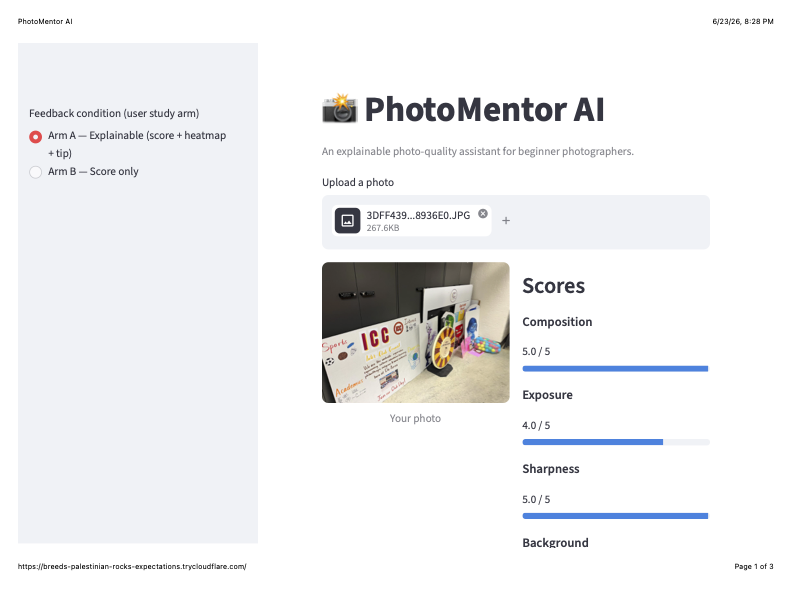
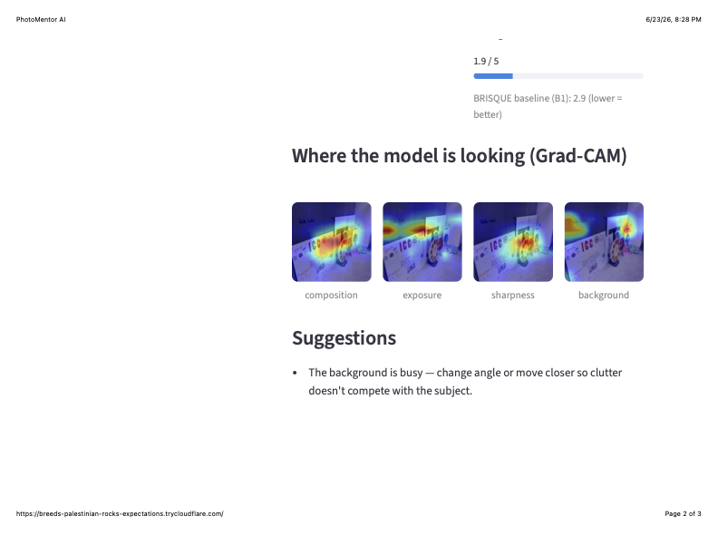

# 📸 PhotoMentor AI

**An explainable photo-quality assistant for beginner photographers.**

Upload a photo → get a 1–5 score on four axes (**composition, exposure,
sharpness, background**), a **Grad-CAM heatmap** showing *where* the model is
looking, and **one actionable suggestion** for what to change.

> **Scope note (read first).** This repo is a **1-week technical MVP** of a
> larger 6-month research plan. The full plan includes a 12–18 person, 2-week
> user study and a published paper; those are **designed and documented** here
> (`docs/user_study_design.md`) but deliberately **not executed** in a week.
> What *is* delivered and working end-to-end: an automated labelled dataset,
> three models (B1/B2/M1), per-axis Grad-CAM, a rule-based feedback engine, a
> leakage-free held-out evaluation with real numbers, and a deployable Streamlit
> demo. A few items were also **descoped during the build** for documented
> reasons — see [What's done vs. descoped](#whats-done-vs-descoped).

---

## How scoring works (important)

The demo scores photos with **deterministic image statistics**
(`src/scoring.py`), not the learned model. This is a deliberate design choice:

- **Exposure** ← luminance histogram (shadow/highlight clipping + mid-tone mass),
  **weighted toward the central subject** so a deliberately dark background does
  not drag down a well-lit subject (a low-key portrait stays correctly exposed)
- **Sharpness** ← variance of the Laplacian (focus / motion blur)
- **Background** ← clutter density over a **4×4 grid** (not just the border) plus
  colour variety, so an intruding object is caught wherever it sits in the frame
- **Composition** ← where the salient mass sits vs the rule-of-thirds lines

**Why not the CNN?** The models below were trained on *synthetic* degradations
(programmatic blur, brightness shifts, edge-density proxies). They score well
on held-out data drawn from that same synthetic distribution, but they fail
**out-of-distribution on real photos** — e.g. they don't reliably tell good
light from bad, or a clean background from a busy one, because real lighting
and clutter don't look like the synthetic training signal. The deterministic
scorer measures the actual physical property instead, so it behaves correctly
on ordinary photos. The CNN + Grad-CAM is retained as an explainability layer
(*where a network attends*), not as the score source.

This is a transparent, classical scorer in the spirit of the B1 baseline — no
training, no distribution assumptions, fully inspectable.

### Where the heuristics are solid vs. approximate

Photo quality is partly subjective, and a pixel-based scorer cannot capture
artistic intent — a deliberately dark, low-key portrait can be excellent yet
read as "underexposed" to any brightness measure. The scorer is therefore tuned
for the **clear, objective cases** rather than fine aesthetic judgement:

| Axis | Reliability | Notes |
|------|-------------|-------|
| Sharpness   | **strong**  | Laplacian variance separates focus/blur robustly. |
| Exposure    | **strong on clear cases** | Central-subject weighting handles low-key portraits; genuine under/over-exposure is detected reliably. Artistic lighting is inherently ambiguous. |
| Background  | **moderate** | Grid clutter catches busy scenes anywhere in the frame, but without true subject segmentation it can over-score clutter that sits against a plain border. |
| Composition | **weakest**  | Rule-of-thirds placement of salient mass is a coarse proxy for a judgement that is largely aesthetic. |

The natural next step to strengthen the background and composition axes is a
proper subject/background segmentation model, which is out of scope for the
one-week build.

---

## Model evaluation (synthetic held-out set)

The numbers below characterise the **learned model M1** on the held-out split of
the synthetic dataset (N=120, no training leakage). They are reported for
completeness and to document exactly why scoring was moved off the model: the
model fits the synthetic axes well in-distribution, which is precisely what does
*not* transfer to real photos.

| Axis | MAE (1–5 scale) | Spearman ρ | 95% CI on ρ | H2 (ρ ≥ 0.5) |
|------|-----------------|------------|-------------|--------------|
| Sharpness   | 0.60 | **0.84** | [0.77, 0.89] | ✅ |
| Background  | 0.72 | **0.78** | [0.69, 0.84] | ✅ |
| Composition | 0.98 | 0.50 | [0.34, 0.62] | ✗ (0.497) |
| Exposure    | 1.13 | 0.42 | [0.25, 0.57] | ✗ |

> **Honest reading.** These are leakage-free held-out numbers
> (`src/evaluate.py` reproduces the training split and scores only the
> validation portion; an earlier leaked "evaluate on everything" version
> reporting ρ up to 0.94 was discarded). But strong *in-distribution* synthetic
> scores did **not** mean the model worked on real photos — testing on real
> images surfaced exactly that gap, which is why the demo now scores with
> measured image statistics. The full research plan closes the loop with a
> larger, human-labelled set (`docs/user_study_design.md`).

Reproduce: `python -m src.evaluate` → writes `results/metrics.csv` (committed).

---

## Demo





```bash
streamlit run app/streamlit_app.py
```

Upload a photo to get the four scores, per-axis Grad-CAM heatmaps, and a
suggestion. The sidebar toggles the two planned user-study conditions
(explainable vs. score-only), so the same app drives both arms of the study.

---

## The three models (the experimental contrast)

| ID | Model | What it establishes | Trained on |
|----|-------|---------------------|-----------|
| **B1** | BRISQUE (classical, no ML) | the "without deep learning" floor | — |
| **B2** | Frozen ResNet-50 + linear head → 4 axes | a basic transfer-learning baseline | custom set |
| **M1** | ResNet-50 (last block unfrozen) + per-axis heads → 4 axes (+ Grad-CAM) | **main contribution**: per-axis scores with spatial explanations | custom set |

B1 gives one number and no spatial explanation — which is exactly why B2 and M1
exist. M1 adds a deeper head per axis and Grad-CAM, so every score comes with a
*where*. Both deep models start from an ImageNet-pretrained ResNet-50 backbone;
B2 keeps it fully frozen (the simple baseline), while M1 unfreezes the last
conv block (`layer4`) at a 5× lower learning rate, with weight decay, to add
capacity without destroying the pretrained features.

---

## Quickstart (Google Colab, free GPU)

```bash
# 1. clone + install
git clone https://github.com/jingyi77777/photomentor-ai.git
cd photomentor-ai
pip install -r requirements.txt

# 2. build the labelled dataset (auto-labelled, balanced across all 4 axes)
python scripts/make_dataset.py --n 300

# 3. train B2 and M1
python -m src.train --model both

# 4. evaluate on the held-out split (MAE, Spearman ρ, 95% bootstrap CIs)
python -m src.evaluate

# 5. run the demo
streamlit run app/streamlit_app.py
```

`scripts/smoke_test.py` runs the whole pipeline on throwaway data in ~10s to
confirm the environment works before touching real data.

> Note: results in the table above were produced with `--n 600` (N=120 held-out).
> `--n 300` reproduces the same pipeline on a smaller, faster set; larger `--n`
> gives a bigger, more stable held-out split.

---

## Dataset and label provenance

The custom set is built by `scripts/make_dataset.py` from royalty-free
[Lorem Picsum](https://picsum.photos) photos (no API key, Unsplash-sourced).
Images are **not committed** to the repo (`.gitignore` covers
`data/custom/*.jpg`) and are used locally only, keeping the licensing clean.

True aesthetic labels can't be collected at scale without a user study, so
labels are engineered to give the model a real, balanced 1–5 range on every
axis. **Three axes are exact by construction; one is a measured proxy.** This is
the central honesty point of the project:

| Axis | How it is labelled | Label quality |
|------|--------------------|---------------|
| Sharpness   | Gaussian blur of known radius | **exact** (controlled) |
| Exposure    | Brightness shift of known factor | **exact** (controlled) |
| Composition | Tilt + centre crop of known degree | **exact-ish** (controlled) |
| Background  | Border edge-density on the clean base, quantile-binned 1–5 | **proxy** (heuristic) |

Every image gets an independent controlled degradation on sharpness, exposure
and composition, so all four axes are balanced across 1–5 and a random
train/val split is balanced on every axis. Background is measured on the clean
base image before any degradation. Full notes: `docs/labeling_log.md`.

---

## What's done vs. descoped

**Done and working in this repo**
- ✅ Automated, balanced, auto-labelled dataset (`scripts/make_dataset.py --n N`).
- ✅ All three models (B1 / B2 / M1) implemented and trained.
- ✅ Per-axis Grad-CAM heatmaps.
- ✅ Rule-based, LLM-free feedback engine (keeps the "explainable" claim clean).
- ✅ Leakage-free held-out evaluation: MAE, Spearman ρ, 95% bootstrap CIs;
     `results/metrics.csv` committed.
- ✅ Streamlit demo implementing both study arms.

**Designed and documented, intentionally not executed in 1 week**
- 📋 12–18 person, 2-week user study (`docs/user_study_design.md`) — H1.
- 📋 IEEE paper / poster / FigShare DOI (research deliverables, not engineering).

**Descoped during the build (documented engineering calls)**
- ⚠️ **AVA large-scale pretraining.** The reachable AVA mirror ships images only,
  with no score labels, so AVA pretraining wasn't possible without a fragile
  scrape. Since ResNet-50 already carries ImageNet features, B2 and M1 are
  trained directly on the custom set instead.
- ⚠️ **Hand-collected 150–250 photo set.** Replaced by the automated set above —
  a deliberate trade of semi-synthetic / proxy labels for a bigger, balanced,
  reproducible dataset. Disclosed, not hidden.

Knowing what to cut when a dependency fails, and saying so plainly, is the point.

---

## Hypotheses (from the research plan)

- **H1** — beginners given explainable feedback improve composition + exposure
  more than score-only feedback. *Requires the user study; designed in
  `docs/user_study_design.md`, not run in this MVP.*
- **H2** — model per-axis scores correlate with labels at Spearman ρ ≥ 0.5.
  **Tested on the held-out split.** Sharpness (0.84) and background (0.78) pass;
  composition (0.497) and exposure (0.42) are positive but below threshold (see
  [Results](#results)).

---

## Repository layout

```
photomentor-ai/
├── app/streamlit_app.py        # the demo (both study arms)
├── scripts/
│   ├── make_dataset.py         # build the labelled set (Picsum + degradation)
│   └── smoke_test.py           # end-to-end pipeline check on throwaway data
├── src/
│   ├── config.py               # all paths & hyperparameters
│   ├── dataset.py              # PyTorch Dataset + transforms
│   ├── models/
│   │   ├── brisque_baseline.py # B1
│   │   └── resnet_models.py    # B2 + M1
│   ├── train.py                # trains B2 and M1 (M1 unfreezes layer4)
│   ├── evaluate.py             # held-out MAE / Spearman / bootstrap CIs
│   ├── feedback.py             # rule-based suggestion engine
│   └── gradcam_utils.py        # per-axis Grad-CAM + inference wrapper
├── docs/
│   ├── labeling_log.md         # labelling protocol + provenance
│   ├── user_study_design.md    # full study (designed, not run)
│   └── images/                 # demo screenshots
├── results/metrics.csv         # held-out evaluation results (committed)
├── requirements.txt
└── LICENSE
```

---

## License

MIT — see `LICENSE`. Base photos are from Lorem Picsum (Unsplash-sourced) and
are not redistributed in this repository.
